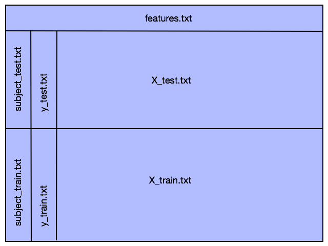
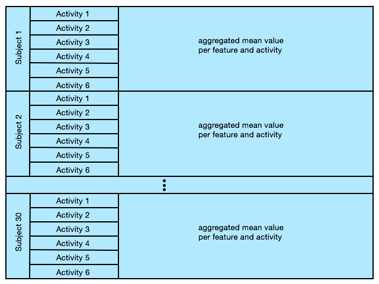

# Getting and Cleaning Data Project CodeBook
---

This file is intended to describe the data and variables used in the project. As well as describe any transformations that were performed to clean the data and produce its resultant output file.

## Overview

Using a smartphone's embedded accelerometer and gyroscope, data was collected from 30 volunteers equipped with a smartphone while performing six activities (WALKING, WALKING_UPSTAIRS, WALKING_DOWNSTAIRS, SITTING, STANDING, LAYING).

## File Description

* `features.txt`: names for all 561 features
* `activity_labels.txt`: names and IDs for each of 6 activities
* `subject_test.txt`: Subject ID related to each of the observations in the *X_test.txt* data set 
* `subject_train.txt`: Subject ID related to each of the observations in the *X_train.txt* data set
* `X_test.txt`: collected data that encompases all of the features for Subjects in the test set
* `X_train.txt`: collected data that encompasses all of the features for Subjects in the training set
* `y_train.txt`: Activity ID related to each of the observations in the *X_train.txt* data set 

The analysis did not use the raw signal data in the "Inertial Signals" folder.

## Processing Steps

1. All of the relavent data files were read into data tables.
2. The training and test data sets were combined into a single data set. Also, column names from the *features.txt* file were added to the data frame depicted below: 

3. Column names for Subject and Activity were added.
4. All feature columns that did not contain "mean" or "std" in the name were removed. Note: Subject and Activity columns are not features and were left in the data table.
5. The Activity column was converted to a factor, and replaced with the descriptive activity name from the *activity_labels.txt* file.
6. The feature names from *features.txt* were replaced with descriptive variable names. For example, *t* was replaced with *Time* and *f* was replaced with *Frequency*, etc.
7. A tidy data frame was created containing the mean of each feature for each subject and each activity. For example, all of the data for Subject 1 was aggregated to 6 rows - one row for each activity, and each row contains the mean value for each of the 86 features for that subject/activity combination. This is repeated for each of the 30 Subjects, for a total of 180 rows. The new data frame structure is demonstrated below:

8. The tidy data set was output to a *tidy.txt* file.

